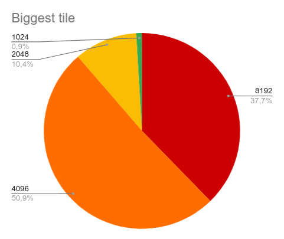
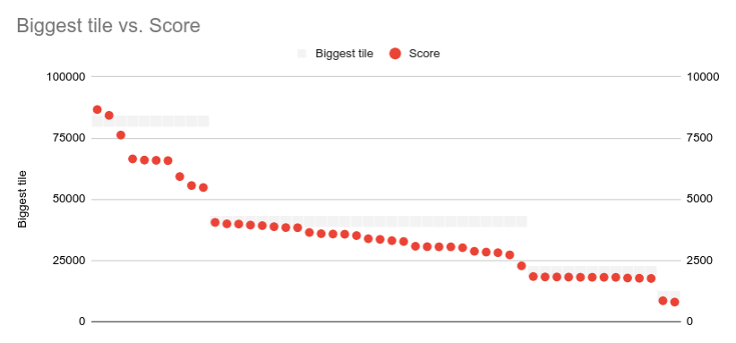

# Testing
## Coverage report: 100%
[](https://codecov.io/gh/Eoyie/algolabra)

## What has been tested and how
### Game manager:
- Game starting: checks score is 0 and there are 14 free tiles.
- Movements: checks for every direction that tiles move correctly by checking the end "wall" of the direction contains at least the first 2 tiles or all 3.
- Set grid:
  - Grid invalidity: check non-valid grids such as ones containing numbers that are not powers of 2.
  - Grid validity: checks changing to valid grid works.
- Add tile: quick test just to see if the given number is placed in the grid. No validity testing for this.
### Game AI
Generally the automatic testing for the AI is very simple: Testing short game loops and a doomed lose grid with the help of a fake play game class. Most of the proper AI testing was done manually.

## Manual testing
For manual testing I let the AI play the game uninterrupted until it lost. All data was collected with the current version of the game, where 4 tiles do exist, but they are not taken into account in Expectiminimax. The code for also searching for 4 tiles does exist in the code, but it is commented out. This version of Expectiminimax is not tested as it is very slow, but generally with a few test runs it does seem to work very well as well.
### I did total 50 runs with Expectiminimax:
| Score | Biggest tile |
| ----- | ------------ |
| 86648 | 8192         |
| 84284 | 8192         |
| 76242 | 8192         |
| 66496 | 8192         |
| 66014 | 8192         |
| 65916 | 8192         |
| 65790 | 8192         |
| 59280 | 8192         |
| 55612 | 8192         |
| 54802 | 8192         |
| 40566 | 4096         |
| 39970 | 4096         |
| 39872 | 4096         |
| 39464 | 4096         |
| 39232 | 4096         |
| 38796 | 4096         |
| 38438 | 4096         |
| 38384 | 4096         |
| 36444 | 4096         |
| 35944 | 4096         |
| 35808 | 4096         |
| 35728 | 4096         |
| 35172 | 4096         |
| 33896 | 4096         |
| 33620 | 4096         |
| 33104 | 4096         |
| 32742 | 4096         |
| 30804 | 4096         |
| 30640 | 4096         |
| 30580 | 4096         |
| 30576 | 4096         |
| 30226 | 4096         |
| 28750 | 4096         |
| 28418 | 4096         |
| 28170 | 4096         |
| 27274 | 4096         |
| 22816 | 4096         |
| 18438 | 2048         |
| 18276 | 2048         |
| 18268 | 2048         |
| 18214 | 2048         |
| 18140 | 2048         |
| 18140 | 2048         |
| 18134 | 2048         |
| 18116 | 2048         |
| 17834 | 2048         |
| 17736 | 2048         |
| 17660 | 2048         |
| 8556  | 1024         |
| 8000  | 1024         |

### Tables to help picture my results
| Tiles reached | Scores reached |
| ------------- | -------------- |
|   |  |

### Current highest achieved score: 86648

It can be determined from my manual testing that generally the AI is very good at completing the game, but it might not always reach 2048. It should be of note, that before adding tile 4s to the game I wasn't able to not reach 2048. I suspect this is the result of expectiminimax not even considering the possibility of 4 tiles existing to be the reason why sometimes 2048 is not reached, while 8192 could often be reached.

## How can the tests be repeated
With:
```
poetry run invoke test
```
Or manually running the game

